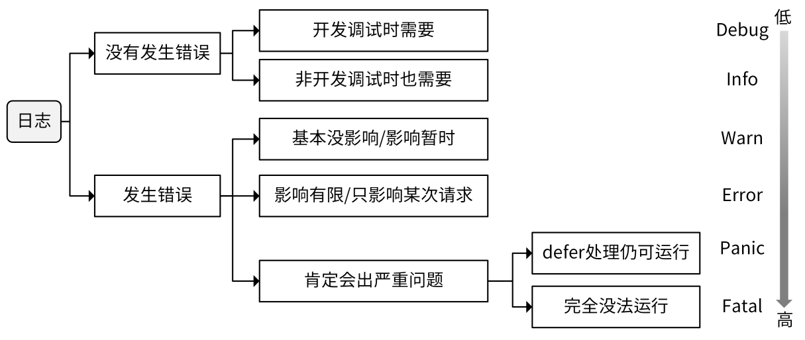

# 日志规范

想要更好地记录日志，我们需要解决以下几个问题：

- 在何处打印日志？
- 在哪个日志级别打印日志？
- 如何记录日志内容？

### 在何处打印日志？

日志主要是用来定位问题的，所以整体来说，我们要在有需要的地方打印日志。那么具体是哪些地方呢？

- **在分支语句处打印日志。**在分支语句处打印日志，可以判断出代码走了哪个分支，有助于判断请求的下一跳，继而继续排查问题。

- **写操作必须打印日志。**写操作最可能会引起比较严重的业务故障，写操作打印日志，可以在出问题时找到关键信息。

- **在循环中打印日志要慎重。**如果循环次数过多，会导致打印大量的日志，严重拖累代码的性能，建议的办法是在循环中记录要点，在循环外面总结打印出来。

- **在错误产生的最原始位置打印日志。**对于嵌套的 Error，可在 Error 产生的最初位置打印 Error 日志，上层如果不需要添加必要的信息，可以直接返回下层的 Error。我给你举个例子：

```go
package main
import (
    "flag"
    "fmt"
    "github.com/golang/glog"
)
funcmain() {
    flag.Parse()
    defer glog.Flush()
    if err := loadConfig(); err != nil {
    glog.Error(err)
}
}
funcloadConfig()error {
    return decodeConfig() // 直接返回
}
funcdecodeConfig()error {
    if err := readConfig(); err != nil {
    return fmt.Errorf("could not decode configuration data for user %s: %v", "colin", err) // 添加必要的信息，用户名称
}
    returnnil
}
funcreadConfig()error {
    glog.Errorf("read: end of input.")
    return fmt.Errorf("read: end of input")
}
```

通过在最初产生错误的位置打印日志，我们可以很方便地追踪到日志的根源，进而在上层追加一些必要的信息。这可以让我们了解到该错误产生的影响，有助于排障。另外，直接返回下层日志，还可以减少重复的日志打印。

当代码调用第三方包的函数，且第三方包函数出错时，会打印错误信息。比如：

```go
if err := os.Chdir("/root"); err != nil {
 log.Errorf("change dir failed: %v", err)
}
```

### 在哪个日志级别打印日志？

不同级别的日志，具有不同的意义，能实现不同的功能，在开发中，我们应该根据目的，在合适的级别记录日志。

- Debug 级别

为了获取足够的信息进行 Debug，通常会在 Debug 级别打印很多日志。例如，可以打印整个 HTTP 请求的请求 Body 或者响应 Body。

Debug 级别需要打印大量的日志，这会严重拖累程序的性能。并且，Debug 级别的日志，主要是为了能在开发测试阶段更好地 Debug，多是一些不影响现网业务的日志信息。所以，对于 Debug 级别的日志，在服务上线时我们一定要禁止掉。否则，就可能会因为大量的日志导致硬盘空间快速用完，从而造成服务宕机，也可能会影响服务的性能和产品体验。

Debug 这个级别的日志可以随意输出，任何你觉得有助于开发、测试阶段调试的日志，都可以在这个级别打印。

- Info 级别

Info 级别的日志可以记录一些有用的信息，供以后的运营分析，所以 Info 级别的日志不是越多越好，也不是越少越好，应以满足需求为主要目标。一些关键日志，可以在 Info 级别记录，但如果日志量大、输出频度过高，则要考虑在 Debug 级别记录。

现网的日志级别一般是 Info 级别，为了不使日志文件占满整个磁盘空间，在记录日志时，要注意避免产生过多的 Info 级别的日志。例如，在 for 循环中，就要慎用 Info 级别的日志。

- Warn 级别

一些警告类的日志可以记录在 Warn 级别，Warn 级别的日志往往说明程序运行异常，不符合预期，但又不影响程序的继续运行，或者是暂时影响，但后续会恢复。像这些日志，就需要你关注起来。Warn 更多的是业务级别的警告日志。

- Error 级别

Error 级别的日志告诉我们程序执行出错，这些错误肯定会影响到程序的执行结果，例如请求失败、创建资源失败等。要记录每一个发生错误的日志，避免日后排障过程中这些错误被忽略掉。大部分的错误可以归在 Error 级别。

- Panic 级别

Panic 级别的日志在实际开发中很少用，通常只在需要错误堆栈，或者不想因为发生严重错误导致程序退出，而采用 defer 处理错误时使用。

- Fatal 级别

Fatal 是最高级别的日志，这个级别的日志说明问题已经相当严重，严重到程序无法继续运行，通常是系统级的错误。在开发中也很少使用，除非我们觉得某个错误发生时，整个程序无法继续运行。

这里用一张图来总结下，如何选择 Debug、Info、Warn、Error、Panic、Fatal 这几种日志级别。



### 如何记录日志内容？

- 在记录日志时，不要输出一些敏感信息，例如密码、密钥等。
- 为了方便调试，通常会在 Debug 级别记录一些临时日志，这些日志内容可以用一些特殊的字符开头，例如 log.Debugf("XXXXXXXXXXXX-1:Input key was: %s", setKeyName) 。这样，在完成调试后，可以通过查找 XXXXXXXXXXXX 字符串，找到这些临时日志，在 commit 前删除。
- 日志内容应该小写字母开头，以英文点号 . 结尾，例如 log.Info("update user function called.") 。
- 为了提高性能，尽可能使用明确的类型，例如使用 log.Warnf("init datastore: %s", err.Error()) 而非 log.Warnf("init datastore: %v", err) 。
- 根据需要，日志最好包含两个信息。一个是请求 ID（RequestID），是每次请求的唯一 ID，便于从海量日志中过滤出某次请求的日志，可以将请求 ID 放在请求的通用日志字段中。另一个是用户和行为，用于标识谁做了什么。
- 不要将日志记录在错误的日志级别上。例如，我在项目开发中，经常会发现有同事将正常的日志信息打印在 Error 级别，将错误的日志信息打印在 Info 级别。

### 记录日志的“最佳”实践总结

- 开发调试、现网故障排障时，不要遗忘一件事情：根据排障的过程优化日志打印。好的日志，可能不是一次就可以写好的，可以在实际开发测试，还有现网定位问题时，不断优化。但这需要你重视日志，而不是把日志仅仅当成记录信息的一种方式，甚至不知道为什么打印一条 Info 日志。
- 打印日志要“不多不少”，避免打印没有作用的日志，也不要遗漏关键的日志信息。最好的信息是，仅凭借这些关键的日志就能定位到问题。
- 支持动态日志输出，方便线上问题定位。
- 总是将日志记录在本地文件：通过将日志记录在本地文件，可以和日志中心化平台进行解耦，这样当网络不可用，或者日志中心化平台故障时，仍然能够正常的记录日志。
- 集中化日志存储处理：因为应用可能包含多个服务，一个服务包含多个实例，为了查看日志方便，最好将这些日志统一存储在同一个日志平台上，例如 Elasticsearch，方便集中管理和查看日志。
- 结构化日志记录：添加一些默认通用的字段到每行日志，方便日志查询和分析。
- 支持 RequestID：使用 RequestID 串联一次请求的所有日志，这些日志可能分布在不同的组件，不同的机器上。支持 RequestID 可以大大提高排障的效率，降低排障难度。在一些大型分布式系统中，没有 RequestID 排障简直就是灾难。
- 支持动态开关 Debug 日志：对于定位一些隐藏得比较深的问题，可能需要更多的信息，这时候可能需要打印 Debug 日志。但现网的日志级别会设置为 Info 级别，为了获取 Debug 日志，我们可能会修改日志级别为 Debug 级别并重启服务，定位完问题后，再修改日志级别为 Info 级别，然后再重启服务，这种方式不仅麻烦而且还可能会对现网业务造成影响，最好的办法是能够在请求中通过 debug=true 这类参数动态控制某次请求是否开启 Debug 日志。