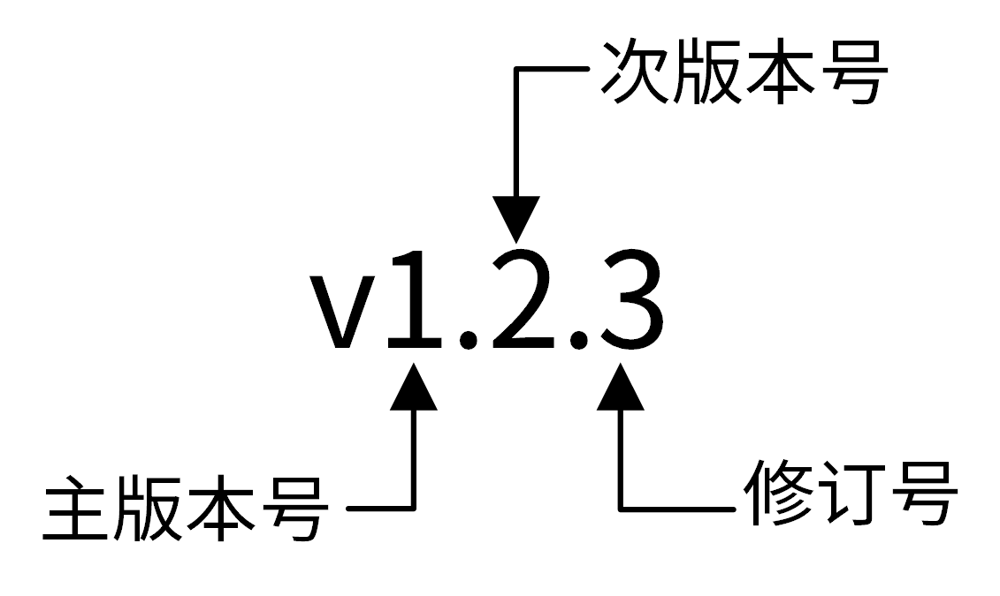

# 版本号规范

>  X、Y 和 Z 为非负的整数

#### X：主版本号

当有不兼容的变更，或重要（核心）功能变更、升级时+1

#### Y：次版本号

常规需求迭代时+1

#### Z：修订号

bug-fix时+1

#### 规则：

- X +1时，Y、Z重置为0
- Y +1时，Z重置为0

#### 初始化开发版本：0.1.0

处于开发初始阶段，一切都可能随时被改变，不应该被视为稳定版

#### 第一个稳定版本的版本号：1.0.0

当软件被用于正式环境，它应该已经达到了 1.0.0 版

#### 示例：

- 常规需求迭代：0.1.Z —> 0.2.Z —> 0.3.Z
- 大版本迭代：1.Y.Z —> 2.Y.Z —> 3.Y.Z
- bug修复：1.Y.0 —> 1.Y.1 —> 1.Y.2

> 当采用前后端分离分开时，前端和后端应该采用不同的版本号

参考：

https://semver.org/lang/zh-CN/